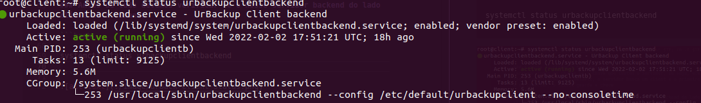
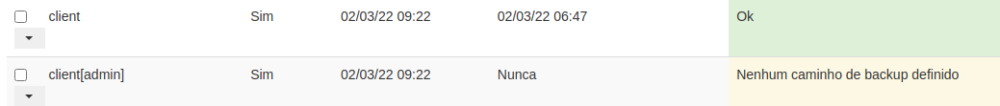
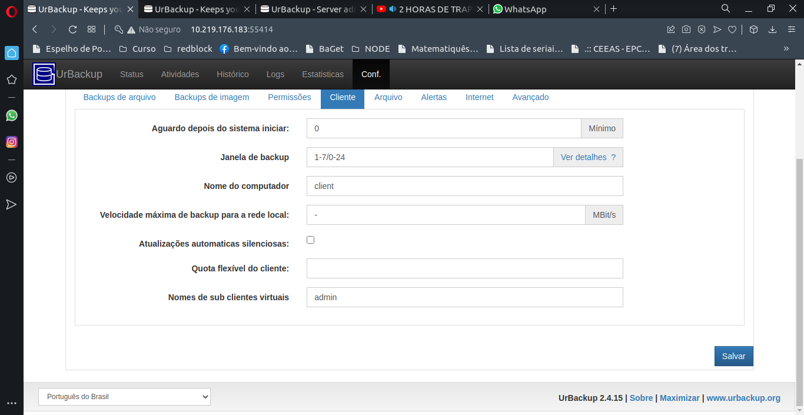
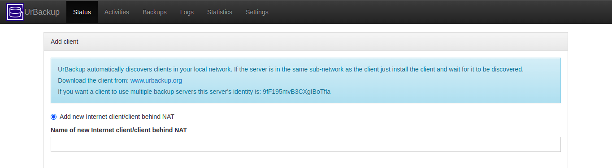
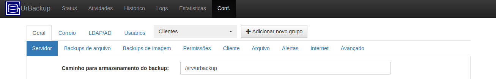

## Configuração do ambiente

### Instalamos o lxd e o cara que vai configurar tudo que vai ser o lxc.
```bash
##instalacao lxd
sudo snap install lxd

##instalacao lxc
sudo apt-get install lxc
```

### Como iremos trabalhar com o disco no formato BTRFS, temos que criar a partição na qual os container ou maquinas vão ser guardadas.

```bash
## Seguindo o comando abaixo, criamos o disco com dois parametros, o nome e o tipo que ele vai ser
lxc storage create <nome-do-storage> btrfs
```
### Após isso, teremos que adequar tambem qual será a rede que a maquina/container vai ter, podendo ter N placas de rede atreladas a ela, mas uma em expecifico é a rede relacionada a sua placa de rede, possibilitanto a visualização do mundo exterior.

```bash
## NEste exemplo temos tres parametros, o nome, o tipo que ela vai ser, e qual o parente dela, ou seja, de quem ela vai endar as caracteristicas
lxc network create eth0 --type=macvlan parent=enp2s0launch
```
### Após todas essas configurações, ou seja, criarmos o disco ao qual o container/vm vai ser executado, termos criado a rede a qual ele vai ter acesso, temos que enfim criar o container/VM.

```bash
## Neste exemplo, criaremos um container que tambem passaremos tres parametros, a versão do linux, o nome, apontamos o storage e a network
lxc launch ubuntu:20.04 <nome-que-voce-quer-na-maquina> --storage <nome-do-storage> --network <nome-da-rede>

## PS: Caso queira atribuir mais de uma rede a um container, siga este comando
lxc network attach <nome-do-container> <nome-da-rede-que-deseja-atrelar>
```
## LXC Snapshot

### Lxc possui um sistema de snapshot e o fato de estarmos utilizando um tipo de disco que nos facilita o salvamento e o restore desse container/VM.

```bash
## Voce cria um snapshot, passando tambem dois parametro, o nome da instancia e o nome do snapshot
lxc snapshot <nome-da-instancia> <nome-do-arquivo>

## Para realizar o restore, a mesma coisa
lxc restore <nome-da-instancia> <nome-do-arquivo>
```

### Para entrar no container/VM que voce criou basta executar.
```bash
## Voce entra na vm
lxc exec <nome-da-instancia> bash
```
```bash
## para configurar a placa no container siga este caimho e aponte o dhcp4
vi /etc/netplan/50-cloud-init.yaml
```
# URBACKUP

# ° Cliente Server

### Para que se possa ter uma instalação limpa do client, devemos seguir estes passos.

```bash
apt update 

apt install build-essential "g++" libwxgtk3.0-gtk3-dev "libcrypto++-dev" libz-dev

TF=$(mktemp) && wget "https://hndl.urbackup.org/Client/2.4.11/UrBackup%20Client%20Linux%202.4.11.sh" -O $TF && sudo sh $TF; rm -f $TF

```
### A parte do client , tem como objetivo adicionar as pastas e carregar todas as chaves ou a chave que contem o servidor, ou seja, ele faz a comunicação, por default, o servidor busca um client e o primeiro a se conectar, o client guarda a chave.

### Antes de tudo devemos verificar se o nosso servidor backend do lado client esta rodando.

```bash

systemctl status urbackupclientbackend

```


### Para adicionar uma pasta para realizar um backup, o comando é: 

```bash 
urbackupclientctl add-backupdir -d /backup
```
### Adicionar uma pasta contem varios parametros importantes, um deles, são os sub-diretorio.

#### ° Sub-diretorio são diretorio aos quais são representações do mesmo cliente, ou seja, do mesmo servidor, mais que são distribuidos e tem a possibilidade de trabalharem de forma separada.

#### Para que se possa ter um sub-diretorio, é necessario que o server principal esteja no ar e que eles ja estejam criado.
```bash
## Passando a flag -v, ativaremos o target sub-diretorio, é aqui que apontaremos para o servidor , qual vai ser o cliente ou o sub target que vai recebebr esta configuração
urbackupclientctl add-backupdir -d /admin -v admin
```

### Como Criar um client Virtual ?
#### Abaixo temos a cara que o client virtual ficara.


### Para que se consiga criar, basta ir em conf -> clientes -> escolha o client, ou seja, o servidor -> vá na aba client -> sub clientes virtuais.


#### Criando isso, conseguimos agora, ir no client e apontar o sub-client.

```bash
### seguimos com o mesmo comando para adicionar mas colocamos a flag -v para apontar o virtual client
urbackupclientctl add-backupdir -d /admin -v admin
```


### Possuindo tudo isso, configurado, sistema já esta pronto para realizar o backup.


### Abaixo temos mais configurações relacionadas a adicionar pasta no servidor:


### Descrição das flags e todas as suas funcionalidades.

Flag | Descrição
---|---
-x| Não cruze o limite do sistema de arquivos durante o backup
-f| Não siga links simbólicos fora do caminho de backup
-d| Diretório
-a| Não compartilhe hashes locais com outros clientes virtuais
-g| Grupo para qual ele pertence
-v| sub cliente virtual ao qual ele pertence
-c| server

### Ainda falando de client, se precisarmos adicionar mais de um servidor atrelado, precisamos pegar o ID do server, e atrelador na pasta de 'server_idents.txt'.


Essa é a chave ao qual voce deve colocar no servidor 

```sh
## Este é o caminho da pasta
vi /usr/local/var/urbackup/server_idents.txt
```


cole a chave que pegamos e esta a mostra na imagem acima
Salve


### Após isso, reinicie o backend do client.

```sh
systemctl restart urbackupclientbackend

## Para acompanhar o resultado
urbackupclientctl status
```
# ° Server Side

### Instalação do servidor é mais facil e todas as configurações tambem facilitam muito pela parte grafica do processo.

```bash

## Primeiro, atualize todos os packages
sudo apt update
## Siga os passos para instalar o server
sudo add-apt-repository ppa:uroni/urbackup \
sudo apt update \
sudo apt install urbackup-server 

Depois de instalado, configure o caminho padrao dele, ou para um disco desejado ou para a pasta srv, onde a permissao de escrita existe, como na imagem abaixo
```


## Setar configuracoes nas VM
lxc config set client limits.memory 2500MB

## Configurações extras

#### caminho e o que eles tem

```bash

/usr/local/var/urbackup => server idents
/usr/local/etc/urbackup => scripts pre-backup

```

#### arrumando o sqlcmd para que o urbackup entenda

```bash
sudo ls /opt/mssql-tools/bin/sqlcmd*
sudo ln -sfn /opt/mssql-tools/bin/sqlcmd /usr/bin/sqlcmd
```

#### Caso o servidor nao apareça o sistem de restore do urbackup

```bash
### Edite esse arquivo e na aba restore coloque RESTORE=server-confirms
vi /etc/default/urbackupclient
service urbackupclientbackend restart
```

#### Criando link simbolico
ln -s /usr/local/var/urbackup /urbackup

#### Para encontrar algo relacionado a algum ambiente 
find . -iname '*urbackup*'

#### Configuração de placa de rede 
```bash
vi /etc/netplan/50-cloud-init.yaml
```